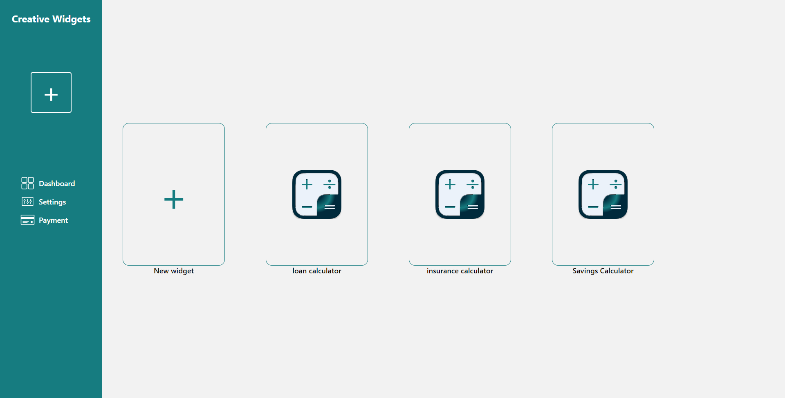
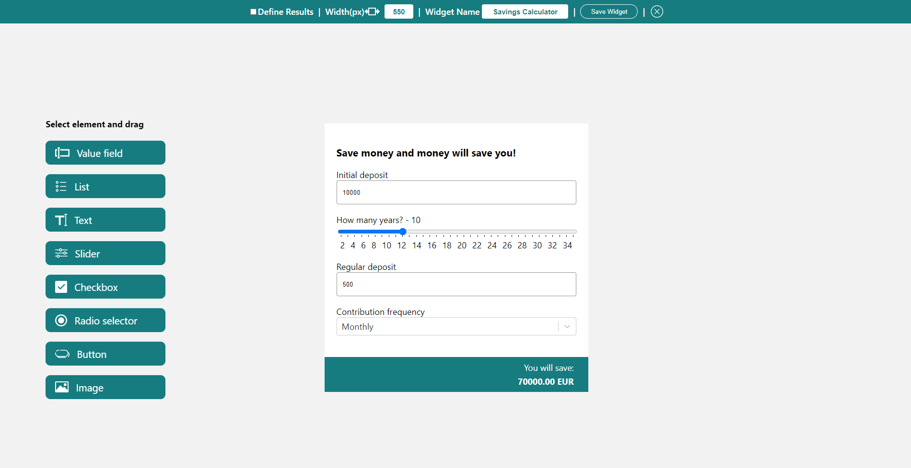
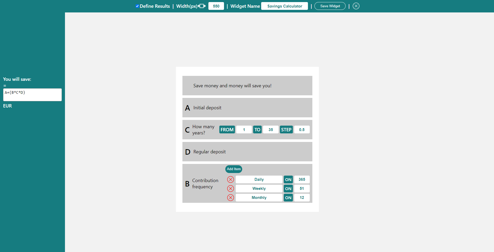

​																							

# Creative Widgets

Creative Widgets is an app that allows website owners to create custom and versatile widgets for their website without any knowledge of coding and increase the engagement of the readers.

## Screenshots

## Getting started

Except for npm packages the app doesn't require any additional software to run.

## Installation

1. Fork the repo
2. Clone repo to the local machine
3. Run `npm i` from the **client** folder
4. Run `npm start` from the **client** folder

### Server part installation

1. Fork the server repo - https://github.com/zenicek/creativeWidgetsServer
2. Clone repo to the local machine
3. Run `npm i` from the **root** folder
4. Run `npm start` from the **root** folder

## Tech Stack

Creative Widgets are running on the below stack

### Back-end

- Express-server
- MongoDB
- Nodejs

### Front-end

- React
